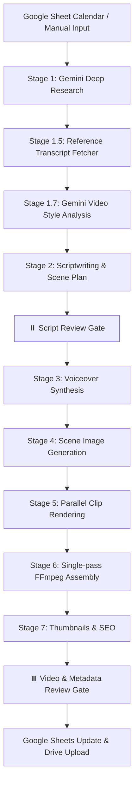

# 🎬 Longform Video Factory

Automated faceless whiteboard, chalkboard, and stickman animation YouTube video pipeline. Goes from a simple topic to a fully compiled educational explainer video with minimal manual intervention.

The system is designed for cloud-native resilience, parallel media rendering, and dynamic account handoffs, allowing you to run the pipeline seamlessly in Google Colab (with optional GPU acceleration) or on local development machines.

---

## 🚀 System Architecture & Workflow Stages

The video production pipeline is organized into modular sequential stages orchestrated by the library's runner. Each stage is cached dynamically to prevent duplicate API expenses and data losses:

### 1. Research & Content Retrieval
*   **Stage 1: Deep Research (`src/researcher.py`)**: Uses the Gemini Deep Research API (`gemini-2.5-pro` Interaction Model) to perform internet-scale research on your topic. Falls back to standard Gemini Flash if required.
*   **Stage 1.5: YouTube Reference Downloader (`src/youtube_reference.py`)**: Automatically searches YouTube for successful videos on your topic, scrapes their English transcripts, and feeds them to the scriptwriter to match successful pacing and vocabulary.
*   **Stage 1.7: Multimodal Video Style Analysis (`src/youtube_clip.py`)**: Downloads a short clip of a YouTube video using `yt-dlp` and performs a multimodal analysis via Gemini to extract visual pacing instructions, metaphors, and drawing styles.

### 2. Scriptwriting & Review Gate
*   **Stage 2: Scriptwriting (`src/scriptwriter.py`)**: Uses Claude or Gemini via OpenRouter to write the video script. The model generates both narration text and explicit scene layout blocks `[SCENE: Description]`. Punctuation breath hints like `[pause]` or `[long pause]` are inserted dynamically.
*   **⏸️ Review Gate 1**: The pipeline halts in Google Colab, displaying the formatted Markdown script for human editing. Any manual modifications saved to the script document on Google Drive are automatically honored when continuing the script execution.

### 3. Media Asset Generation
*   **Stage 3: Voice Synthesis (`src/voice.py`)**: Generates high-quality narration. Uses the Fish Audio API (with custom voice cloning) or a local Qwen3-TTS GPU-fallback. Generates word-level timestamps using Whisper to align subtitles.
*   **Stage 4: Scene Image Generation (`src/scene_gen.py`)**: Generates visual representations of each scene. Integrates fallbacks across Vertex AI Imagen and Google AI Studio, and defaults to custom Pillow-generated text cards if all APIs fail.

### 4. Rendering, Finalizing & Publishing
*   **Stage 5: Parallel Clip Rendering (`src/assembler.py`)**: Individual visual slides are rendered in parallel to a local directory using CPU or GPU-accelerated video encoders.
*   **Stage 6: Single-Pass Video Assembly (`src/assembler.py`)**: Concatenates scene clips, mixes background music (BGM) with volume controls, and burns in custom word-level highlighted subtitles.
*   **Stage 7: Publishing Assets (`src/seo.py`, `src/scene_gen.py`)**: Generates YouTube SEO metadata (optimized title, description with tags, category ID) and three distinct AI-generated thumbnail variants.
*   **⏸️ Review Gate 2**: Allows previewing the compiled video, thumbnail options, and description directly in the notebook before marking the spreadsheet row as `complete`.

---

## 🎨 Visual Styles

Set visual styles globally or per-video in the Google Sheet's `Style` column:

### 1. Color Whiteboard (`color_whiteboard`)
*   **Aesthetic**: Colorful marker outlines on a clean white background.
*   **Composition**: 2D minimalist hand-drawn cartoon shapes, diagrams, and educational sketches with clean borders.
*   **Effects**: Gentle camera pan/zoom animations (Ken Burns) alternating between slides with smooth crossfades (0.5s).

### 2. Chalkboard (`chalkboard`)
*   **Aesthetic**: White and colored chalk drawings on a green chalkboard canvas.
*   **Composition**: Heavy chalk dust textures and sketch-style strokes representing visual concepts.
*   **Effects**: Gentle camera pan/zoom animations (Ken Burns) and subtle crossfades.

### 3. Stickman (`stickman`)
*   **Aesthetic**: Snappy stick-figure storytelling inspired by channels like *CGP Grey* and *Stickman Explained*.
*   **Composition**: Simple hand-drawn black stick figures with highly expressive faces and minimal flat color accents (e.g. red, yellow, blue) to guide attention.
*   **Pacing & Density**: Doubles visual pacing (scenes transition every 5–10 seconds, ~12–25 words of narration) to keep modern viewers engaged.
*   **Effects**: No Ken Burns camera movement, utilizing **instant hard cuts** for visual pacing.
*   **Dynamic Backgrounds**: Gemini dynamically selects light visual canvas backgrounds (off-white, grid math paper, or blueprint background lines) depending on each scene's subject matter.

---

## 📦 Account Handoff & Google Drive Resumption

Whiteboard videos can require significant rendering tasks and API queries. The pipeline supports **Multi-Account Resume** and **Bandwidth-Efficient Syncing** to bypass rate limits or daily VM quotas:

1.  **Shared Folder Sharing**: Share a Google Drive project directory using a shared link (viewable/writable by any of your Google accounts).
2.  **Handoff Setup**: Paste the URL into the notebook's `PROJECT_FOLDER_URL` parameter on a new account or Colab VM instance.
3.  **Sync on Demand**: The pipeline initializes the project local folder structure and runs an **incremental fetch-on-demand sync**. It downloads only metadata files (`script.md`, `scenes.json`) first. Subfolders (e.g., `audio/`, `scenes/`, `clips_cache/`) are downloaded incrementally *only* when their respective stage begins.
4.  **Automatic Variable Alignment**: The system automatically reads `scenes.json` from the shared folder and aligns notebook variables (`TOPIC`, `NICHE`, `STYLE`) with the remote state, ensuring you do not need to reconfigure them.
5.  **Scene-Level Resumption**: If a crash occurs or you need to skip rendering prior slides, set `RESUME_FROM_SCENE = <scene_index>`. The pipeline treats all preceding scenes as finalized and resumes rendering at the selected slide.

---

## 🛠️ Configurations & Variables

### Environment Variables (.env)

| Key | Required | Default | Description |
|---|---|---|---|
| `GOOGLE_API_KEY` | Optional | `""` | Google AI Studio key (not required if using Vertex AI). |
| `OPENROUTER_API_KEY` | Yes | `""` | OpenRouter API Key for scriptwriting & SEO. |
| `FISH_API_KEY` | Yes | `""` | Fish Audio key for TTS. |
| `FISH_VOICE_ID` | Yes | `""` | Cloned voice ID from the Fish Audio console. |
| `PEXELS_API_KEY` | Optional | `""` | Pexels video API key for stock B-roll downloads. |
| `GOOGLE_SHEET_ID` | Optional | `""` | Google Sheet content calendar spreadsheet key. |
| `DEFAULT_MODEL` | Optional | `anthropic/claude-sonnet-4` | Default LLM for script writing. |
| `USE_VERTEX` | Optional | `false` | Set to `true` to route research and image calls through Vertex AI. |
| `GCP_PROJECT` | Optional | `""` | GCP Project ID (required for Vertex AI). |
| `GCP_LOCATION` | Optional | `us-central1` | GCP region for Vertex AI. |
| `PAUSE_BETWEEN_SCENES` | Optional | `0.8` | Default pause added to scene timelines (seconds). |
| `RENDER_MAX_WORKERS` | Optional | `20` | Default parallel thread workers for clip rendering. |
| `USE_REFERENCE_CLIPS` | Optional | `false` | Toggle downloading reference video clips for Gemini analysis. |
| `REFERENCE_CLIP_DURATION` | Optional | `60` | Duration (seconds) of reference video clip downloads. |

---

## 📝 Cell-by-Cell Notebook Guide

The notebook cells are arranged in logical workflow execution blocks:

### Cell 0: Setup & Install
Installs pip requirements, clones the latest repository version to the Colab disk, mounts Google Drive, and registers folders.

### Cell 1: Credentials & API Keys
Loads parameters. Prefers Google Colab's Secrets manager (`google.colab.userdata`). Alternatively, uncomment Option B to define environment variables manually. Runs OAuth authentication for Google Sheets access.

### Cell 2 & 3: Fetch & Pick Topic
*   **`TOPIC_INDEX`**: Row pointer to select a topic from the Google Sheet content calendar.
*   **`PROJECT_FOLDER_URL`**: Optional shared folder URL for multi-account handoffs.
*   **`RESUME_FROM_SCENE`**: Set to a slide index integer (e.g. `43`) to skip preceding generations.

### Cell 4: Initialize Paths
Prepares project subdirectories. If `PROJECT_FOLDER_URL` is active, it connects to Google Drive API, pulls root configuration files, reads `scenes.json`, and overrides topic details to match.

### Cell 5: Stage 1 - Deep Research
*   **`FORCE_RESEARCH`**: Set to `True` to ignore cached `research.md` files and force a fresh research execution.

### Cell 6: Stage 2 - Script Generation
*   **`SCRIPT_MODEL`**: Target scriptwriting model (defaults to `anthropic/claude-3-5-sonnet`).
*   **`FORCE_SCRIPT`**: Overwrites existing scripts.
*   **`FORCE_REFERENCE_FETCH`**: Forces a download of new reference scripts from YouTube.
*   *Behavior*: If dynamic style analysis results are found from Cell 10, their aesthetic directions are automatically combined into the script prompt context.

### Cell 7: Script Review Gate
Displays the generated script in Markdown. The user is prompted to edit the raw script file inside Google Drive if text modifications are needed.

### Cell 8: Stage 3 - Voice Generation
*   **`TTS_ENGINE`**: Select `'fish'` (cloned voice) or `'qwen_1.7b'`/`'qwen_0.6b'` (GPU-accelerated local narration).
*   **`FORCE_VOICE`**: Force regenerate audio tracks.
*   *Behavior*: Automatically downloads existing voice files incrementally from Google Drive if a shared project is detected.

### Cell 9: Stage 4 - Scene Image Generation
*   **`FORCE_SCENES`**: Overwrites all images.
*   **`REGENERATE_SCENES`**: Set to a list of integers (e.g. `[2, 14]`) to overwrite only specific slides.
*   *Dynamic Customization*: Place any custom chart, graph, or B-roll image named `scene_XX.png` inside the `scenes` folder. The generator will detect it, skip generating an image for that scene, and the assembler will include your custom graphic in the final video.

### Cell 10: Stage 5 - Video Assembly
*   **`BGM_PATH`**: Path to local background music audio file.
*   **`BGM_VOLUME`**: Target volume level (e.g., `0.15`).
*   **`KEN_BURNS`**: Set to `True` for zoom animations (automatically ignored when style is `stickman`).
*   **`RENDER_WORKERS`**: Thread counts for rendering slide clips in parallel.
*   **`SKIP_SUBTITLES`**: Toggles subtitle burn-in.

### Cell 11: Compress Video
Uses FFmpeg to produce an ultra-compressed version of the output video (<100MB) for quick human download and review directly in Colab.

### Cell 12, 13, 14: Thumbnails, SEO, and Finalize
Generates three thumbnail variants and YouTube SEO descriptions. Previews them for user review and pushes data back to the Google Sheets row, marking the topic as `complete`.

---

## 💎 Performance & Feature Upgrades

*   **Parallel Slide Compilation**: Utilizes a `ThreadPoolExecutor` worker pool to compile individual scenes to visual clips simultaneously. This reduces scene rendering bottlenecks by up to 5x.
*   **Single-Pass FFmpeg Compile**: Concatenation of scene clips, crossfade transitions, audio blending (voice + music), and subtitle burning are executed in a single FFmpeg compilation pass, preventing progressive compression degradation and improving compile speed.
*   **Flicker-Free Subtitles**: Words are grouped into blocks where active words are highlighted via `` markup tags. The subtitle end-time overlaps with the next cue's start-time, eliminating black flickering frames between subtitles.
*   **Adaptive Rate-Limit Fallbacks**: Image generation dynamically catches `429 Resource Exhausted` rate limits, applying exponential backoff delays. If limits are reached, the system automatically falls back from Vertex AI to AI Studio, and finally to local Pillow-rendered placeholder slides.
